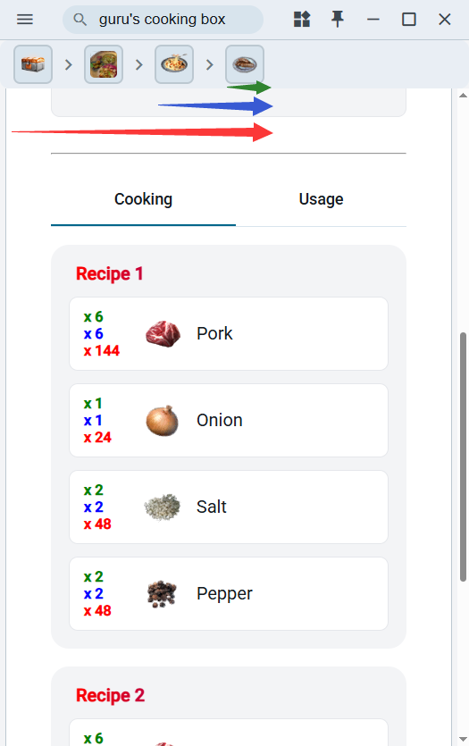

# Document

## Setup Instructions

1. Download the application from the releases page.
2. Open (https://drive.google.com/file/d/1IAxk5DSVRcPrBOytydtg3ionAIgVnM96/view?usp=sharing) & download.
3. UNZIP and move files according to the file structure below.
4. Launch the app.

## File structure
```
|------- 
|-- bdoPF.exe
|-- config.json (auto-generated)
|-- public/
|---- gamecommondata
|---- product_icon_png
|---- locales (auto-generated)
|---- dynamic_strings.json (auto-generated)
```

## Using the Features

### Crafting Notes
- Access the Crafting Notes section to view recipes and quantities for items.
- Search for specific items to see their crafting requirements.
- The `green` number shows how many items are required.
- The `blue` number shows the current quantity multiplied by the previous item’s quantity.
- The `red` number shows the total number crafted so far, starting from the first item.


### Boss Schedule
- Check the Boss Schedule to see world boss spawn times.
- Use this to plan your gameplay around boss fights.

### Quick Notes
- Use Quick Notes to jot down tips, reminders, or important information.
- Your notes are saved locally for easy access.

### Useful Links
- Browse Useful Links for quick access to BDO-related websites.
- Save time by having all resources in one place.

### Useful Tools
- Stay tuned for upcoming tools that will enhance your BDO experience.

## Language Support
- The app supports multiple languages. Select your preferred language in the settings.

## Troubleshooting
- If you encounter issues, ensure your system meets the requirements.
- Check the FAQ or contact support for help.
